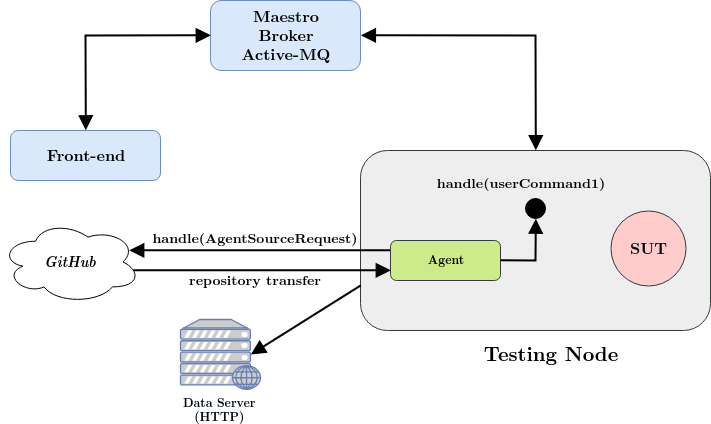

Maestro: Agent
============

**Maestro Agent** is a component which offers node manipulation during the test. The Agent offers topology changes during the test, 
change attributes of the network interface on each node or change the configuration of the messaging component ont he node.
The agent is designed to operate on the each SUT node.

Extension Points
---- 
Since the agent is able to perform any action, it's necessary to define these actions. The Agent is designed to clone external git repository
and then executes scripts available in the repo based on received note:
* **MAESTRO_NOTE_AGENT_SOURCE** - the agent clone the repo based on the payload value
* **MAESTRO_NOTE_USER_COMMAND_1** - the agent perform specific command based on the payload value

Each execution is done in a new thread which offer an option to perform multiple actions during one test. 
The user need to specify few environmental variables for the test:
* **EXT_POINT_SOURCE** - URL to git repository with definitions of user actions written in Groovy
* **EXT_POINT_BRANCH** - branch of passed repository
* **EXT_POINT_COMMAND** - command which will be executed

The example of extension point code is available in [maestro-agent-sample-extpoints](https://github.com/maestro-performance/maestro-agent-sample-extpoints) or 
[maestro-agent-expoints-dispatch](https://github.com/maestro-performance/maestro-agent-extpoints-dispatch) repositories.

In the following Figure one can see the example of node with active Maestro Agent next to the SUT.

Time Specification
---- 
The agent does not care about the specific time of execution. It's only download the code and perform it. However, we want to
perform the code at some specific time, not only on the start of the test. This time has to be specified in the script itself with a sleep command.
For example if user want to perform script code on the 3rd minute of the test, one should use `sleep(180000);` in te script.
