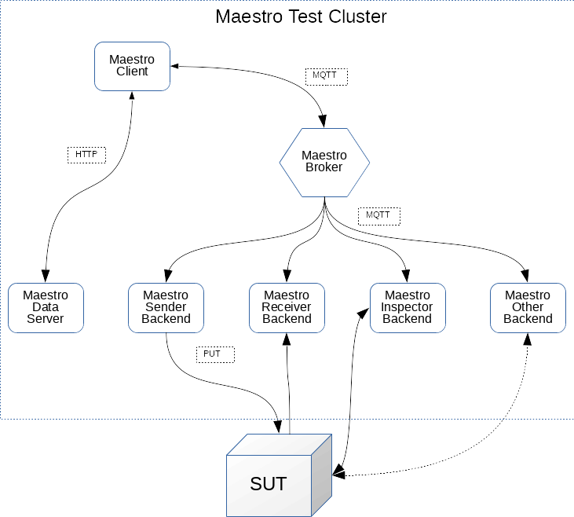

Maestro Deployment
============

Maestro Architecture and Overview
----

Maestro works by coordinating the work of multiple nodes to generate load and simulate load behavior 
hitting the software under test (SUT). The set represented by the Maestro client, its nodes (aka backends)
and the Maestro cluster is referenced as the Maestro Test Cluster.   



Maestro can be used for both low-scale as well as large scale tests. For large scale tests, the recommended
way is to deploy multiple nodes, each on a dedicated environment. For small scale and local tests, the docker
containers should be sufficient (at a small performance penalty cost of ~10% in the max throughput).

The backends generate the load on the SUT using the Protocol Under Test (PUT), which can be any of the supported
protocols.

Maestro Deployment: Multi-host deployment via Ansible
----

There are 3 Ansible roles that can be used to deploy a Maestro test cluster: 
* [ansible-maestro-java](https://github.com/msgqe/ansible-maestro-java): to deploy maestro workers
* [ansible-maestro-broker](https://github.com/msgqe/ansible-maestro-broker): to deploy a Maestro broker
* [ansible-maestro-client](https://github.com/msgqe/ansible-maestro-client): to deploy a Maestro client

These can be used along with other roles to deploy the desired Software Under Test (SUT). 
For example:
* [ansible-amq-broker](https://github.com/msgqe/ansible-amq-broker): to deploy JBoss A-MQ 7 or Apache Artemis single host brokers
* [ansible-broker-clusters](https://github.com/msgqe/ansible-broker-clusters): : to deploy JBoss A-MQ 7 or Apache Artemis clustered brokers
* [ansible-qpid-dispatch](https://github.com/rh-messaging-qe/ansible-qpid-dispatch): to deploy QPid Dispatch Router

This is a much more complex deployment model, but usually desired as it can be made to 
represent real messaging use case scenarios involving multiple hosts.

Maestro Deployment: Single-host deployment via Docker Compose
----

This method is targeted towards development of Maestro and aims to make it simpler to 
deploy and develop local Maestro test clusters. This deployment model is really simple and
it is possible to get started with Maestro testing by running just 3 or 4 commands.

**Note**: although it would be possible to use this model for production testing, this is 
a new feature that needs to be matured.  

This deployment method is documented in greater detail [here](../docker-compose/maestro)


Maestro Libraries: Deploying in Self-Maintained Maven Repository
----

If you maintain your own Maven repository, you can deploy this library using:

```
mvn deploy -DaltDeploymentRepository=libs-snapshot::default::http://hostname:8081/path/to/libs-snapshot-local
```


