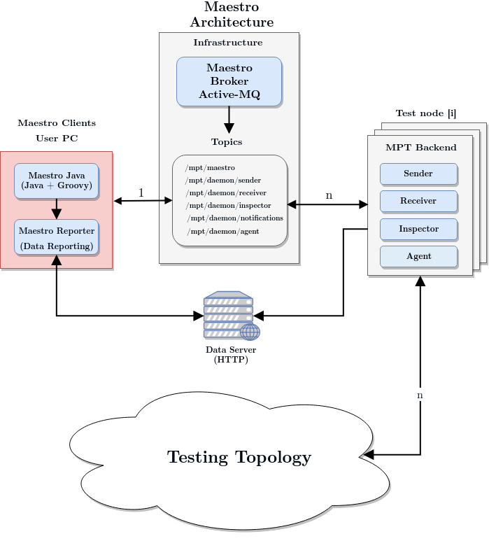
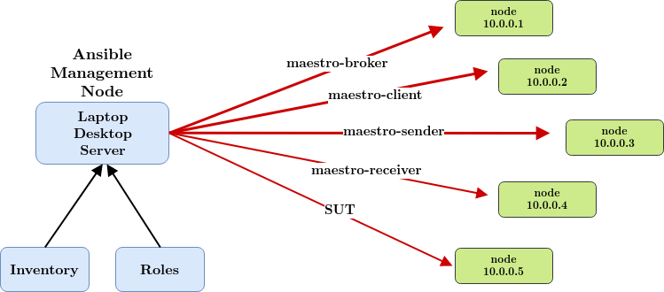

Maestro Deployment
============

Maestro Architecture and Overview
----

Maestro works by coordinating the work of multiple nodes to generate load and simulate load behavior 
hitting the software under test (SUT). The set represented by the Maestro client, its nodes (aka backends)
and the Maestro cluster is referenced as the Maestro Test Cluster.

The preferred way of running larger deployments of Maestro is within an container-orchestration system such as
[Kubernetes](http://kubernetes.io), [Origin Community Distribution of Kubernetes](http://www.okd.io).



Maestro can be used for both low-scale as well as large scale tests. For large scale tests, the recommended
way is to deploy multiple nodes. For small scale and local tests, the docker containers should be sufficient (at a 
small performance penalty cost of ~10% in the max throughput).

The backends generate the load on the SUT using the Protocol Under Test (PUT), which can be any of the supported
protocols.


Get Maestro
----

You can find official Maestro packages on the [Docker Hub](https://hub.docker.com/r/maestroperf/). Maestro tarballs 
can also be found [here](http://www.orpiske.net/files/maestro-java/), although the tarballs are not guaranteed to be the
latest.

**Note**: It is very easy to build Maestro. Check the [Development Guide](Development.md) for details about how to build 
Maestro and have the latest tarballs if that is what you need.

Maestro Deployment: Quick Start Using Docker Compose 
----

This quick start brings up a small Maestro test cluster with 2 workers and a reports collector. You can find the 
deployment templates in the deploy directory within the maestro-cli installation directory.   

  
Make sure that you have [Docker Compose](https://docs.docker.com/compose/) installed.  

```
cd /path/to/maestro-cli/deploy/docker-compose/
docker-compose -f docker-compose-sample.yml -f suts/docker-artemis-compose.yml up --scale worker=2 --scale agent=0 --scale exporter=0 --scale inspector=0
```

Please take note of the networks created by Docker Compose. For this exercise, the important one is `maestro_cluster` 
(or one named very similar in the unlikely case you already have a network named like that). 

You should see a mix of different outputs from the containers launched. You can access the reports server on 
http://localhost:6500.

With the cluster up, we can launch the client container:

```
docker run -it -h maestro-client --network=maestro_cluster maestroperf/maestro-client:edge
```

Inside the client container, check that you have the worker nodes up and running:

```
[root@maestro-client reports]# maestro-cli maestro -m $MAESTRO_BROKER -c ping
11:07:45,616 Connecting to Maestro Broker
11:07:45,629 Connection to tcp://broker:1883 completed (reconnect = false)
Command                 Name               Host                              Group Name    Member Name
MAESTRO_NOTE_PING       worker             ca5f29c782aa                      all                     
MAESTRO_NOTE_PING       worker             b123d2f6ef14                      all                     
11:07:46,181 Finalizing Maestro peer connection
```

And if you have a similar output, it means that everything is working as expected and you can run Maestro tests from 
the client container. You can find additional details about using Maestro with Docker Compose [here](../docker-compose/maestro).

Maestro Deployment: Using Kubernetes
============

This deployment method is documented in greater detail [here](../kubernetes).

Maestro Deployment: Multi-host deployment via Ansible
----

There are 3 Ansible roles that can be used to deploy a Maestro test cluster: 
* [ansible-maestro-java](https://github.com/msgqe/ansible-maestro-java): to deploy maestro workers
* [ansible-maestro-broker](https://github.com/msgqe/ansible-maestro-broker): to deploy a Maestro broker
* [ansible-maestro-client](https://github.com/msgqe/ansible-maestro-client): to deploy a Maestro client

These can be used along with other roles to deploy the desired Software Under Test (SUT). 
For example:
* [ansible-amq-broker](https://github.com/msgqe/ansible-amq-broker): to deploy JBoss A-MQ 7 or Apache Artemis single host brokers
* [ansible-broker-clusters](https://github.com/msgqe/ansible-broker-clusters): : to deploy JBoss A-MQ 7 or Apache Artemis clustered brokers
* [ansible-qpid-dispatch](https://github.com/rh-messaging-qe/ansible-qpid-dispatch): to deploy Qpid Dispatch Router

This is a much more complex deployment model, but usually desired as it can be made to represent real messaging use case 
scenarios involving multiple hosts.




Maestro Deployment: Verifying the Test Cluster
---- 

Run the ping command to check if the test cluster was deployed correctly: 

```
maestro-cli maestro -c ping -m mqtt://host:1883
```

The output should be similar to this:

```
15:42:46,997 Connecting to Maestro Broker
15:42:47,340 Connection to tcp://my.host.com:31883 completed (reconnect = false)
Command                 Name               Host                              Group Name    Member Name
MAESTRO_NOTE_PING       inspector          maestro-inspector-67d8947bdd-k9zr6    all                     
MAESTRO_NOTE_PING       worker             maestro-worker-77c94d6df7-kwpr9    all                     
MAESTRO_NOTE_PING       worker             maestro-worker-77c94d6df7-48ppf    all        
```
