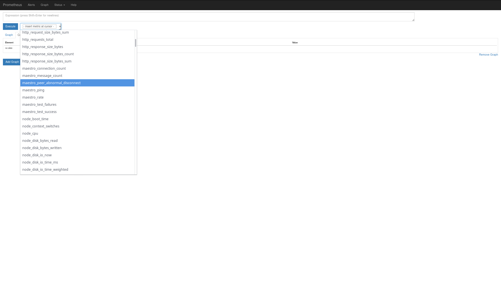
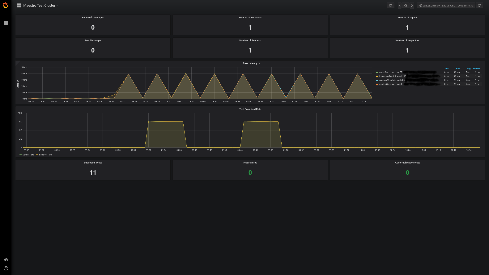

Maestro: Monitoring
============

Certain test patterns may require monitoring of the test execution and behavior of the workers. Maestro comes with a 
component called exporter that integrates with [Prometheus](https://prometheus.io/). This component monitors the state
of the test cluster. It also comes with a (Grafana Dashboard)[https://grafana.com/] that exposes the cluster statistics.


Setting up
----

As long as a Prometheus instance is already available, setting the monitoring for Maestro is not significantly difficult
in any way. The exporter works by collecting cluster statistics (via Maestro API, using the STATS note) and publishing
them in a way that is parseable by Prometheus itself.

To get the monitoring running, the following steps are needed: 

1. Configure the address of the maestro broker in the ```maestro-exporter-service.conf``` configuration file:

```
# The URL of the Maestro broker
MAESTRO_BROKER="mqtt://localhost:1883" 
```

It needs to point to the broker address.

2. Launch the service using `maestro-exporter-service` (or running the `maestro-exporter` with the appropriate CLI 
options).  

3. Check that the service was launched by accessing the exposed port (9120). 

A sample output should look like this:

```
# HELP maestro_message_count Message count
# TYPE maestro_message_count gauge
maestro_message_count{peer="receiver@perf-dev-node-05.host.com",type="receiver",} 0.0
maestro_message_count{peer="sender@perf-dev-node-04.host.com",type="sender",} 0.0
maestro_message_count{peer="inspector@perf-dev-node-06.host.com",type="inspector",} 0.0
maestro_message_count{peer="agent@perf-dev-node-07.host.com",type="agent",} 0.0
# HELP maestro_test_success Test success
# TYPE maestro_test_success counter
maestro_test_success 0.0
# HELP maestro_ping Ping
# TYPE maestro_ping gauge
maestro_ping{peer="receiver@perf-dev-node-05.host.com",type="receiver",} 1.0
maestro_ping{peer="sender@perf-dev-node-04.host.com",type="sender",} 1.0
maestro_ping{peer="inspector@perf-dev-node-06.host.com",type="inspector",} 1.0
maestro_ping{peer="agent@perf-dev-node-07.host.com",type="agent",} 1.0
# HELP maestro_test_failures Test failures
# TYPE maestro_test_failures counter
maestro_test_failures 0.0
# HELP maestro_connection_count Connection count
# TYPE maestro_connection_count gauge
maestro_connection_count{peer="receiver@perf-dev-node-05.host.com",type="receiver",} 0.0
maestro_connection_count{peer="sender@perf-dev-node-04.host.com",type="sender",} 0.0
maestro_connection_count{peer="inspector@perf-dev-node-06.host.com",type="inspector",} 0.0
maestro_connection_count{peer="agent@perf-dev-node-07.host.com",type="agent",} 0.0
# HELP maestro_rate Rate
# TYPE maestro_rate gauge
maestro_rate{peer="receiver@perf-dev-node-05.host.com",type="receiver",} 0.0
maestro_rate{peer="sender@perf-dev-node-04.host.com",type="sender",} 0.0
maestro_rate{peer="inspector@perf-dev-node-06.host.com",type="inspector",} 0.0
maestro_rate{peer="agent@perf-dev-node-07.host.com",type="agent",} 0.0
# HELP maestro_peer_abnormal_disconnect Abnormal disconnect count
# TYPE maestro_peer_abnormal_disconnect counter
maestro_peer_abnormal_disconnect 0.0
```


4. Configure prometheus instance by editing `prometheus.yml` and including this at the end of the file:

```  - job_name: 'maestro'
       scrape_interval: "15s"
       static_configs:
         - targets: ["maestro.exporter.host.com:9120"]
``` 

This instructs Prometheus service to scrap the data that is exported by the Maestro exporter. 


5. Relaunch prometheus service: `systemctl restart prometheus`.

At this point, you should be able to see the Maestro metrics as exported from Prometheus Graph UI: 





Grafana Integration
----

To setup the Grafana Dashboard, use the Dashboard import feature and import the dashboard provided with the code base.
The dashboard file is available [here](../../maestro-exporter/extras/grafana/dashboard/maestro_test_cluster.json).

.